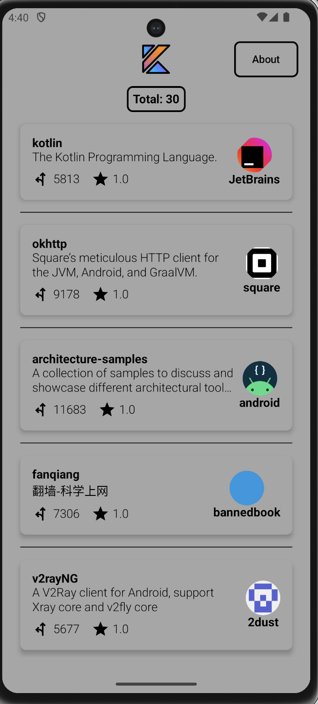
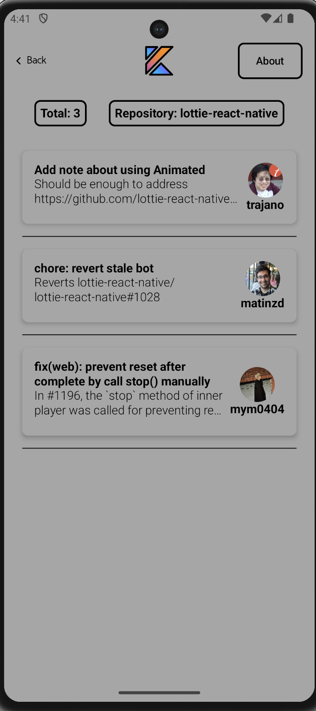
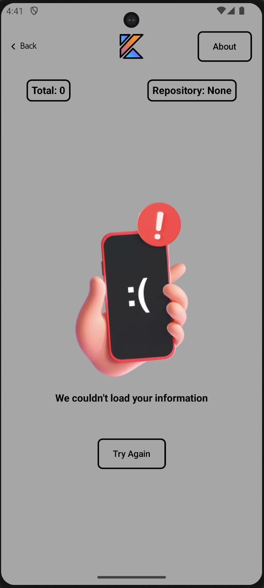
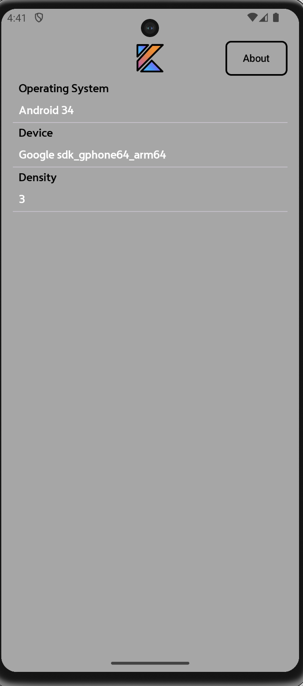
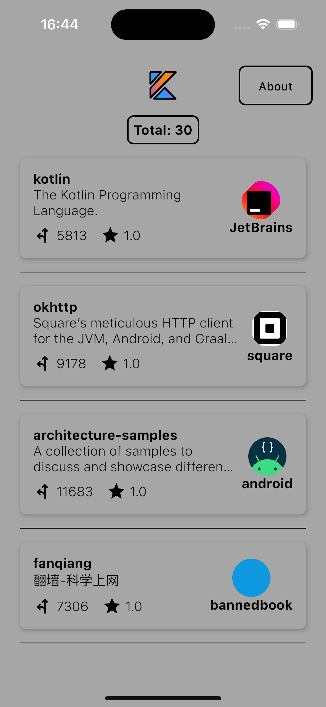
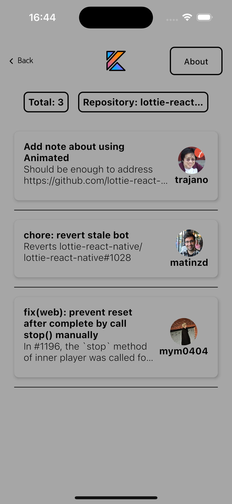
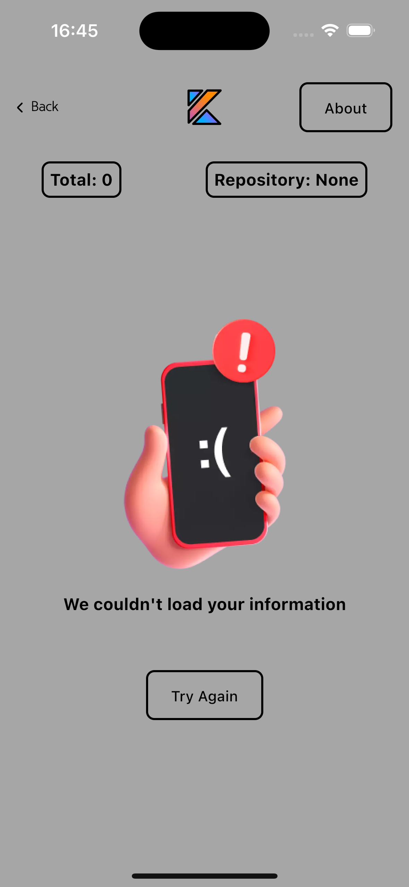
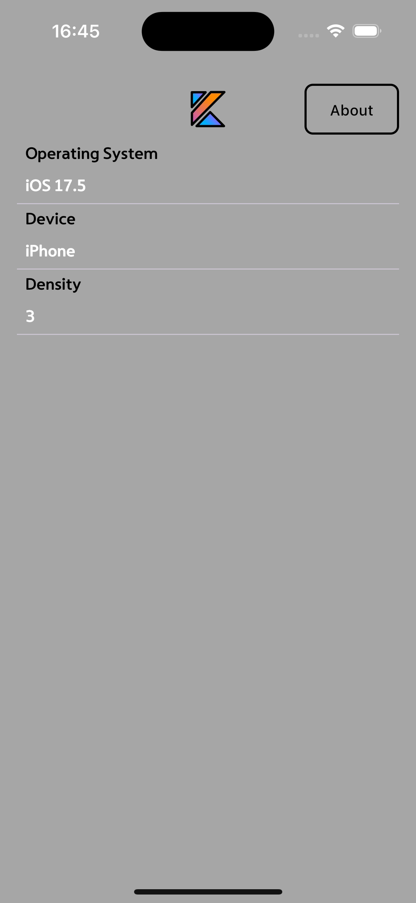

# Github KotlinPop - App
## Github KotlinPop | Android | Kotlin | KMP

Welcome to Github KotlinPop App project! This guide will walk you through setting up the environment to test the project on your local machine.

`Jetpack Compose` & `MVI Architecture` & `KMP`

## 📖 About the Project

Github KotlinPop is a project that utilizes the [GitHub API](https://api.github.com) to display Kotlin repositories and their associated Pull Requests. The app is built with Kotlin Multiplatform (KMP), enabling shared logic and UI between Android and iOS platforms. The goal is to provide an efficient and modular solution to explore Kotlin repositories and their contribution details.

## 📷 Android Previews

<p align="center">



</br>
</p>

## 📷 iOS Previews

<p align="center">



</br>
</p>

## 🛠 Tech Stack & Open Source Libraries
- Minimum SDK level 24.
- 100% [Jetpack Compose](https://developer.android.com/jetpack/compose) based + [Coroutines](https://github.com/Kotlin/kotlinx.coroutines) + [Flow](https://kotlin.github.io/kotlinx.coroutines/kotlinx-coroutines-core/kotlinx.coroutines.flow/) for asynchronous operations.
- [Paging 3](https://developer.android.com/topic/libraries/architecture/paging/v3-overview): Efficient pagination of large datasets.
- [Ktor](https://ktor.io/): For network requests.
- [StateFlow](https://kotlinlang.org/api/kotlinx.coroutines/kotlinx-coroutines-core/kotlinx.coroutines.flow/-state-flow/): To manage state within the app.
- [SharedFlow](https://kotlinlang.org/api/kotlinx.coroutines/kotlinx-coroutines-core/kotlinx.coroutines.flow/-shared-flow/): For event-driven programming.
- Jetpack:
    - Compose: Android’s modern toolkit for building native UI.
    - ViewModel: UI-related data holder and lifecycle-aware.
    - App Startup: Provides a straightforward, performant way to initialize components at application startup.
    - Navigation: For navigating screens and [Koin Compose] for injecting dependencies.
- [Koin]: Dependency Injection.

## 🛠 Modularization

The project is organized into a modular structure for better scalability and maintainability:

### Modules:

- **composeApp**: The main application module, containing platform-specific entry points and UI logic.
- **Core**: Contains shared utilities, network logic, and common configurations used across the project.
- **DS (Design System)**: Manages UI components, styles, and themes to ensure design consistency across the app.
- **Common**: Holds shared business logic, domain models, and other common utilities that are used across platforms.

## ✍️ Prerequisites

- Android Studio installed on your machine with Java 17.

## Getting Started

1. **Install Java 17:**

    ```
    https://www.oracle.com/java/technologies/javase/jdk17-archive-downloads.html
    ```

2. **Clone the Repository:**

    ```
    https://github.com/lukesteves92/GithubKotlinPop.git
    ```

3. **Open Project in Android Studio:**

   Open Android Studio and navigate to `File` > `Open` and select the cloned project directory.

4. **Set Java 17 by Default:**

   Open Android Studio and navigate to `File` > `Settings` > `Build, Execution...` > `Build Tools` > `Gradle` and select the new `Gradle SDK` downloaded, Java 17.

5. **Run the App:**

    - Build and run the Github KotlinPop in Android Studio.

Congratulations! You have successfully set up the environment to test the Github KotlinPop project on your local machine. If you encounter any issues, feel free to reach out for assistance. Enjoy!